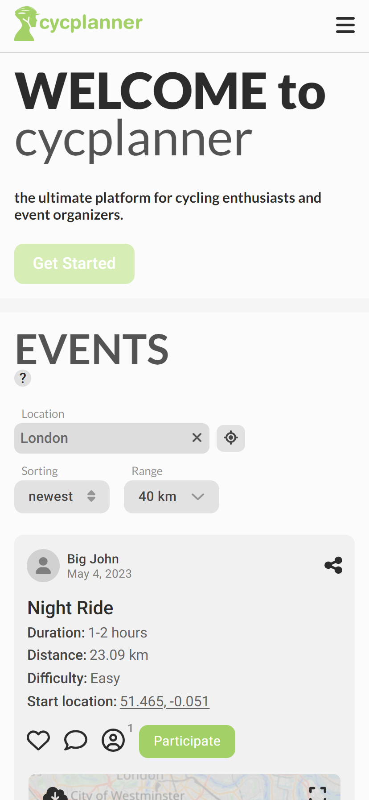
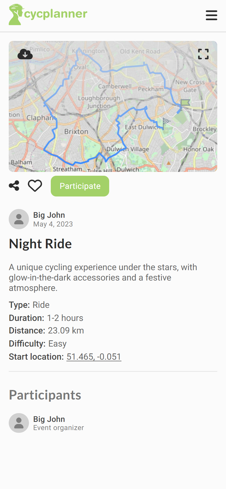
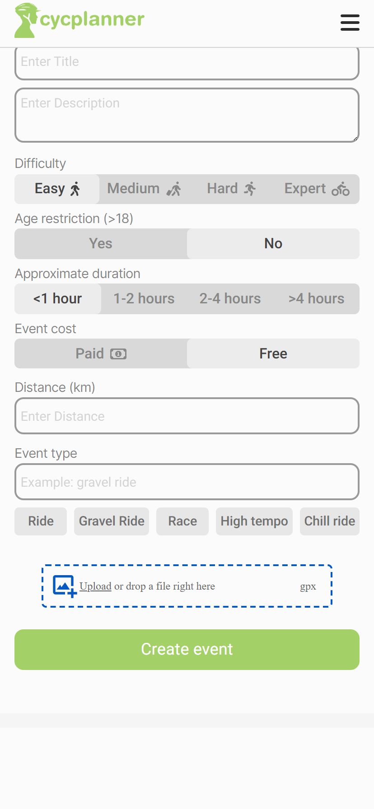
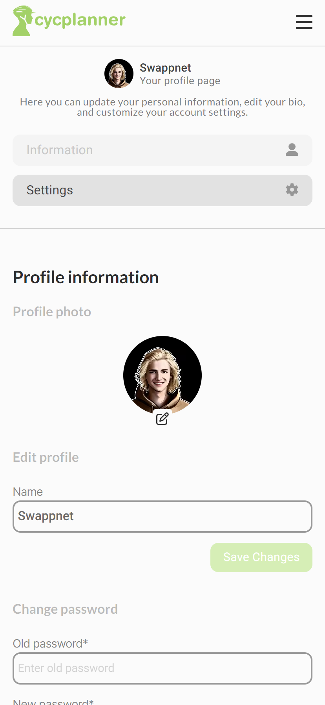

`cycplanner` is a full-stack web application that allows users to create, organize, and join cycling events in their area. This project was created using React, Next.js, and Firebase.

Live - https://cycplanner.vercel.app/

### Features

    * Sign up and sign in functionality using Firebase Authentication.
    * Create, edit, and delete cycling events.
    * Join and leave cycling events.
    * View cycling events in your area.
    * Filter cycling events by location, distance, and date.
    * View and edit your profile information.

### Technology Stack

    React
    Next.js
    Firebase
    Styled Components
    TypeScript

    
    
    
    

    
    
### How to start?

   1. Clone the repository: `git clone https://github.com/swappnet/cycplanner.git`.
   2. Install dependencies: `npm install`.
   3. Set up a Firebase project and add your Firebase configuration to `.env.local` file in the root directory. You can use the `.env.local.example` file as a template.
   4. Start the development server: `npm run dev`.
   5. Open http://localhost:3000 in your browser to view the app.

### Contributing

Contributions to 'cycplanner' are welcome! If you would like to contribute, please follow these steps:

    1. Fork the repository.
    2. Create a new branch for your feature or bug fix.
    3. Write your code and tests.
    4. Push your changes to your fork.
    5. Create a pull request.

---

### License

`cycplanner` is licensed under the MIT license. See the LICENSE file for more information.

### Acknowledgements

`cycplanner` was created by Swappnet as a project for cycling community.

<h4>Liked the work ?</h4>
Give the repository a star :-)

